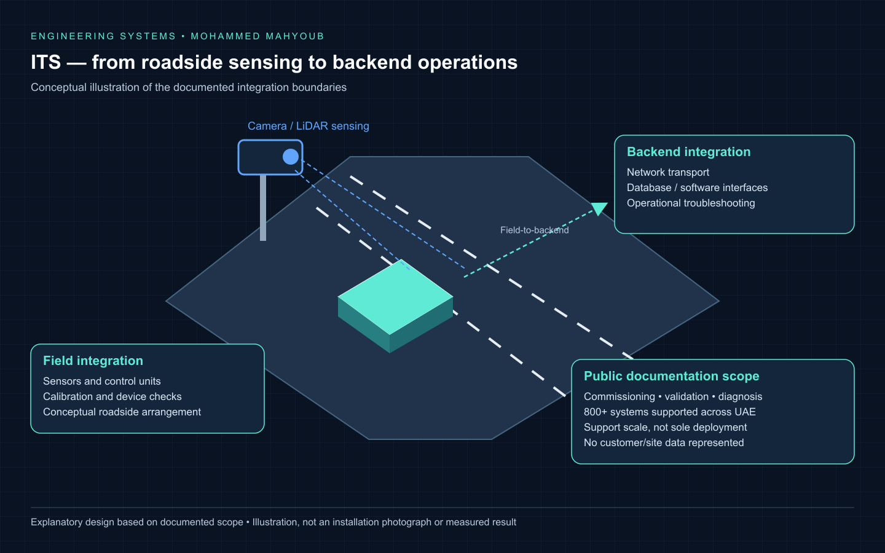
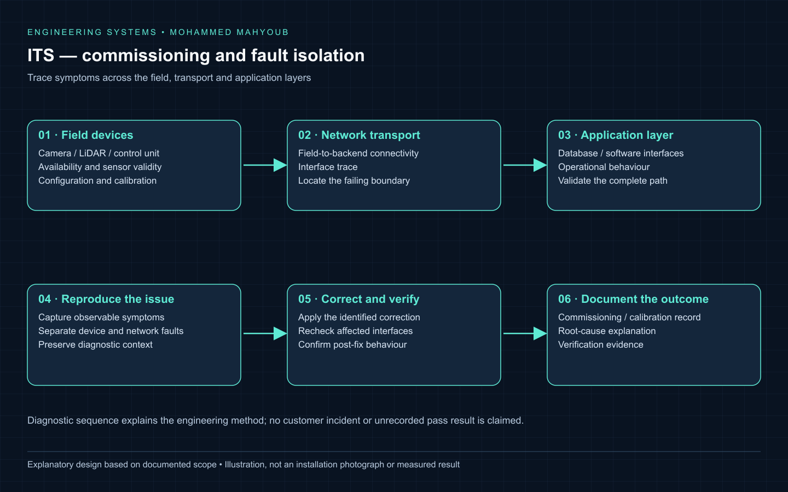

# ITS Systems Integration & Traffic Enforcement Support

[Read case study](https://mahyoub88.github.io/projects/proj-its-support/) · [Project index](docs/PROJECTS.md) · [Engineering guide](docs/engineering-guide.md)

## Illustrated implementation walkthrough

### ITS — from roadside sensing to backend operations

[Open the scalable diagram](docs/visuals/its-field-to-backend.svg).

### ITS — commissioning and fault isolation

[Open the scalable diagram](docs/visuals/its-diagnostic-workflow.svg).

The roadside illustration links sensing and control equipment to transport and backend software. The diagnostic workflow explains how commissioning and troubleshooting cross those boundaries: establish device validity, trace connectivity, reproduce the symptom, correct the identified fault and verify the affected path.

*These visuals were designed for this documentation. They explain the implemented scope; placement and geometry are illustrative, and the figures are not installation photographs, circuit schematics or new test results.*

## Implementation at a glance

Field and backend integration, commissioning, calibration, validation and troubleshooting of intelligent traffic-enforcement systems.

| Responsibility | Documented implementation |
|---|---|
| Field layer | Cameras, LiDAR, sensors and control units. |
| Transport and interfaces | Networking, databases and software interfaces connect field equipment to backend operations. |
| Commissioning | Installation support, calibration and validation across hardware and software boundaries. |
| Diagnosis | Trace the fault through device, transport and application layers, then verify behaviour after the fix. |

The documented 800+ figure is the number of systems supported across the UAE, not a claim of sole design or deployment. Public documentation omits customer identities, site configurations and enforcement data. The diagrams illustrate functional responsibilities.

### Architecture and implementation workflow

*Documentation diagrams based on the project scope; original source images and results are captioned separately.*

[Full engineering guide](docs/engineering-guide.md) · [Illustrated case study](https://mahyoub88.github.io/projects/proj-its-support/)

---

**Author:** Mohammed Mahyoub.

Supported the integration, commissioning, calibration, validation, troubleshooting, and operational performance of intelligent traffic enforcement systems across field and backend environments.

## Scale

800+ intelligent transportation and traffic enforcement systems supported across the UAE.

## Role

Field and systems engineering across cameras, LiDAR, sensors, control units, networking, databases, and software interfaces.

## Method

Structured commissioning and root-cause analysis to resolve integration issues across hardware, networking and software.

## Technologies

ITS, System Integration, Commissioning, Calibration, Troubleshooting

## Links

- [Portfolio project](https://mahyoub88.github.io/projects/proj-its-support/)

- [ITS Systems Integration & Traffic Enforcement Support — technical walkthrough](docs/technical-walkthroughs/proj-its-support.md)
