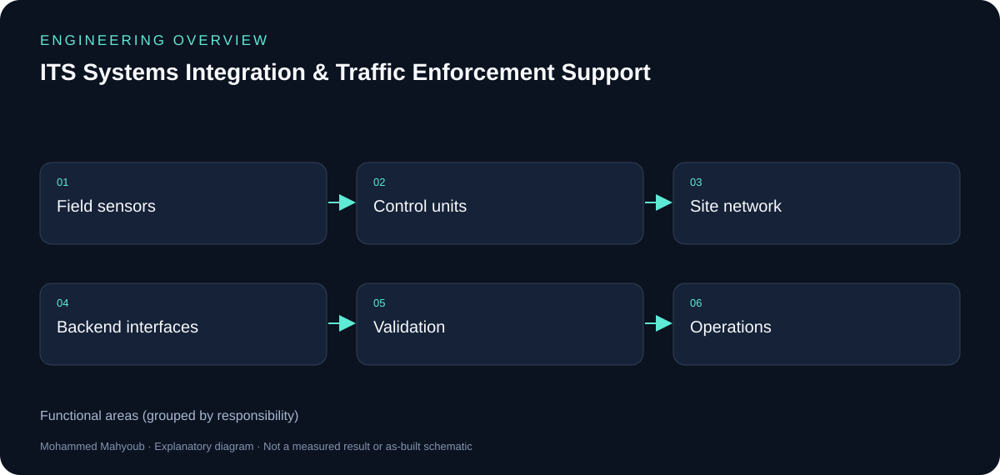
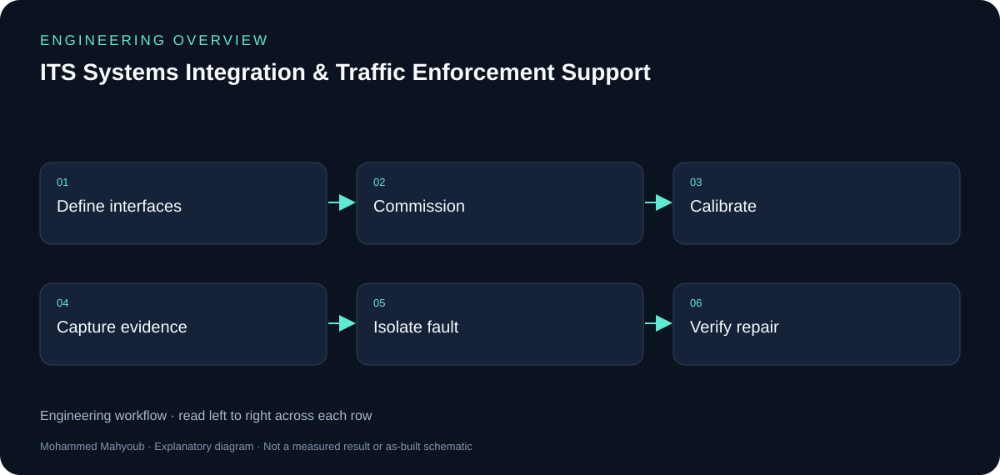

# ITS Systems Integration & Traffic Enforcement Support — Engineering Guide

Supported the integration, commissioning, calibration, validation, troubleshooting, and operational performance of intelligent traffic enforcement systems across field and backend environments.

## Visual overview

*New explanatory diagram; grouped responsibilities, not an as-built schematic or test result.*

*New explanatory workflow; a documentation aid, not evidence that every proposed check was performed.*

## Integration boundaries

Cameras, LiDAR and control units form one part of the system; network transport, databases and software interfaces form the next. A fault should be traced across those boundaries rather than attributed to the first device showing a symptom.

## Commissioning and diagnosis

The documented work covers installation support, commissioning, calibration, validation and operational troubleshooting. Evidence should distinguish device health, transport availability and application behaviour. This public case study omits customer identities, site configurations and enforcement data.

## What the scale means

The published 800+ figure describes systems supported across the UAE. It is not a claim that every system was independently designed or deployed by one engineer.

## Evidence to review or collect

The following are suggested review checks. A checklist entry is not a claimed pass result.

- Device availability and sensor validity.
- Field-to-backend interface trace.
- Calibration/commissioning record.
- Fault reproduction and post-fix verification.

## Sources and provenance

- [Published portfolio description](https://mahyoub88.github.io/#proj-its-support).
- [Project README](../README.md) and existing repository files.
- [LinkedIn projects](https://www.linkedin.com/in/mohammed-mahyoub/details/projects/): supplementary descriptions and project media.
- New SVG figures and explanatory text were authored for this documentation update; they are not original photographs or new measured results.
- Original implementation photos and raw results were not available in the inspected public repository; the new diagrams provide explanation without substituting for that evidence.
