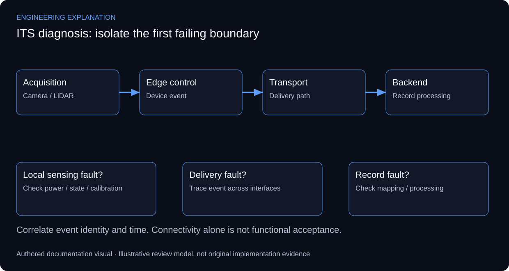

# ITS Systems Integration & Traffic Enforcement Support

## Tracing an enforcement event across system boundaries

The documented responsibility spans roadside cameras, LiDAR, sensors and control units, transport connectivity, databases and software interfaces. The reported 800+ systems describes the support scope across the UAE. It does not represent a count of systems designed or installed by one engineer. This case study focuses on integration and diagnosis, with customer and enforcement records excluded from the public material.

An event must remain traceable as it crosses the acquisition, edge-processing, transport and backend boundaries. A useful diagnostic record associates the device identity, event time, observed symptom and receiving service. These are an explanatory record model, not a disclosure of the deployed database schema or a claim that the system implements syslog. RFC 5424 supplies a reference for separating structured event content from its transport.

Diagnosis starts at the first boundary where expected behaviour differs from observed behaviour. A powered device can still have a sensing or calibration fault; an available IP endpoint can still have an application-interface fault. Checking the next boundary only after establishing the previous one avoids mistaking connectivity for complete functional acceptance.

For an anonymised review, capture a symptom, the boundary inspected, the evidence inspected, the corrective action and the follow-up observation. Calibration readings and acceptance thresholds must come from the applicable device procedure. The diagram below explains fault localisation without exposing customer addresses, enforcement images or installation-specific settings.

*New explanatory responsibilities and review criteria; not an as-built drawing or new test result.*

## Review scenarios and expected evidence

These are review criteria, not additional completed tests.

| Review area | Method | Evidence to inspect |
|---|---|---|
| No event at edge | Inspect power, sensing state and local diagnostics | A local event or a documented device fault |
| Event at edge, absent at backend | Trace link, queue and receiving interface | Correlated event across the affected boundary |
| Event received, incomplete record | Review field mapping and processing errors | Expected record fields and explicit rejected-event handling |
| After corrective action | Repeat the affected functional path | Dated follow-up observation, not only a successful ping |

## Primary technical references

- [Syslog message model — RFC 5424](https://www.rfc-editor.org/rfc/rfc5424)

References support the explanation, not undocumented implementation claims.

No customer records, device configurations or new calibration results are published. The review scenarios below describe how to assess the documented responsibility; they are not additional completed test claims.

[Published case study](https://mahyoub88.github.io/projects/proj-its-support/).
